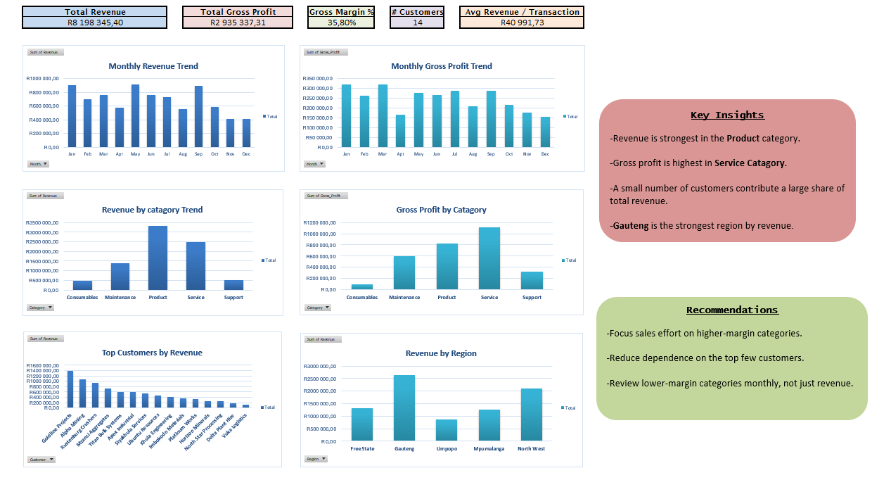
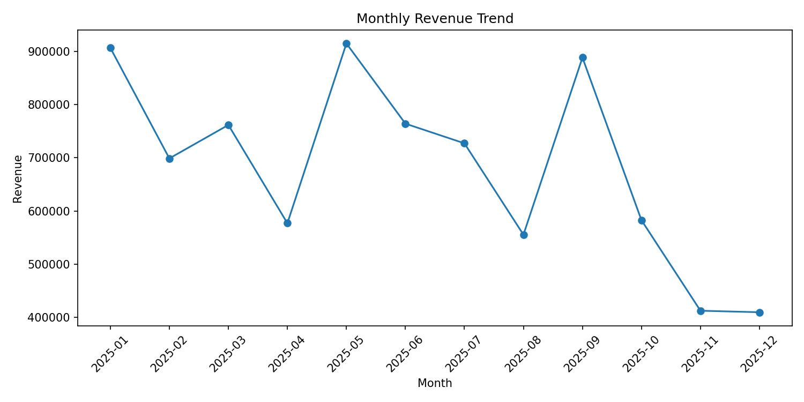

# Business Performance Dashboard

**Turning 12 months of industrial sales transactions into a management view of revenue, margin, customers and regions.**

> All figures are in South African Rand (ZAR). The dataset is simulated to mirror a South African industrial services business (200 transactions, Jan-Dec 2025).

## Business Problem
Management had transactional data but no single view of commercial performance. They could not easily see which categories made money, how dependent the business was on a few customers, or whether sales were holding up through the year.

## Headline Findings

| Metric | Result |
|---|---|
| Total revenue | R8,198,345 |
| Total gross profit | R2,935,337 (35.8% margin) |
| Transactions / customers | 200 / 15 |
| Average transaction | R40,992 |

1. **Sales are falling.** Revenue dropped from R906k in January to R410k in December (-55%). Q4 revenue (R1.40M) was 41% below Q1 (R2.37M).
2. **The decline is about volume, not price.** Q4 had 37 transactions versus 59 in Q1 (-37%), while average deal size held roughly steady (R38.0k vs R40.1k). The business is closing fewer deals, not smaller ones.
3. **Product drove the collapse.** Product revenue fell 75% from its Q2 peak (R1.35M) to Q4 (R340k).
4. **Biggest category is not the most profitable.** Product is 40.5% of revenue but earns only 24.8% margin. Service is 30.4% of revenue at 44.5% margin and delivers the largest share of gross profit (37.8%). Support has the highest margin (60.6%) but is only 6.4% of revenue.
5. **Customer concentration is high.** Goldline Projects alone is 16.8% of revenue. The top 3 customers make up 41.2% and the top 5 make up 57.2%.
6. **Regions.** Gauteng (32.2%) and North West (25.6%) together deliver 58% of revenue. Gauteng has the lowest margin (33.0%). Limpopo is the smallest region (10.7%) but has the best margin (39.1%).

## Recommendations
1. **Diagnose the Q4 drop first.** Break down lost volume by customer and category, starting with Product, to see whether it is seasonal, a lost account or a pipeline problem.
2. **Shift sales effort toward Service and Support.** Each rand of Service revenue earns about 20 cents more gross profit than Product. Illustratively, replacing R500k of Product sales with Service would add roughly R98k in gross profit.
3. **Manage concentration risk.** With over half of revenue in five customers, set a review trigger (for example, any customer above 15% of revenue) and build a pipeline of mid-sized accounts.
4. **Review pricing in Gauteng and on Consumables.** Gauteng carries the lowest regional margin and Consumables the lowest category margin (19.7%).
5. **Grow Limpopo selectively.** It is small but profitable, so it is a candidate for extra sales coverage.

## Method
1. Loaded the raw transactional data (`Raw_Data`).
2. Built a clean working sheet (`Clean_Data`) with control checks: `Check_Revenue`, `Check_Gross_Profit`, `Check_Cost_Valid`. All 200 rows passed.
3. Added analysis fields: Month, Quarter, Year, Gross_Margin_Pct, Revenue_Band.
4. Built pivot tables for monthly trend, category, customer and region analysis.
5. Designed the dashboard: KPI cards, six charts, key insights and recommendations.
6. Reproduced the monthly revenue trend in Python (pandas, matplotlib) as a cross-check.

## Dashboard Components
KPI cards (Revenue, Gross Profit, Gross Margin %, Customers, Average Revenue per Transaction), monthly revenue and gross profit trends, revenue and gross profit by category, top customers, revenue by region.

## Tools
Excel (structured tables, pivot tables, pivot charts, data validation, KPI design), Python (pandas, matplotlib).

## Files
- `data_raw/` raw transactional data
- `data_clean/` validated dataset and pivots
- `images/` dashboard screenshot and Python chart
- `writeup/` project case study
- `python/` trend analysis script

## Possible Extensions
Target vs actual reporting, monthly forecasting, customer-level profitability, a live data connection.
