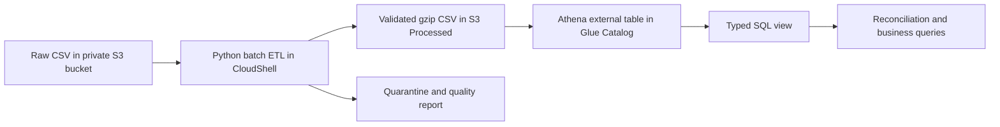

# Retail sales pipeline on AWS

## Status

Cloud batch pipeline verified. Jaco ran the ETL in AWS CloudShell and supplied the completed S3 upload output on 30 September 2026. On 1 October 2026, he supplied Athena reconciliation results matching the local quality report across all eight checks. Monthly trends, December negative invoice groups and detailed transaction evidence have also been verified against exported Athena results. Read the [case study](writeup/CASE_STUDY.md) and [verification record](VERIFICATION.md).

Bucket: `cjb-retail-pipeline`. Region: Europe (Stockholm), `eu-north-1`. Existing prefixes: `Raw/` and `Processed/` (capitalisation matters). Expected source key: `Raw/Online_Retail.csv`; confirm the filename in the console.

## Business purpose

Prepare UCI Online Retail invoice-line data for analysis of monthly transaction values, geographic contribution, identified customers and cancellations. Unit prices are GBP. There are no cost fields, so this dataset cannot establish profitability or margin. Invoice line value is not cash received, nor independently verified recognised revenue.



## Data policies

- Preserve the raw file. Track its SHA-256 fingerprint and source record number.
- Reject missing invoice/stock/country, invalid dates, invalid customer IDs, fractional/zero quantities, negative/nonfinite prices and positive-quantity cancellation invoices. Rejected original records and reasons remain in quarantine.
- Preserve missing customer IDs for aggregate sales analysis; exclude them only from customer-specific analysis.
- Preserve negative quantities and cancellation invoices. Separate cancellations, negative adjustments, zero-price lines and positive sales.
- Flag repeated full source records but retain them: there is no unique line ID proving these are errors. Query their impact separately.
- Retain source price precision up to four decimal places and use decimal arithmetic.
- Normalise whitespace in descriptions so CSV fields have no embedded newlines for Athena OpenCSVSerde.
- Reconcile input = accepted + rejected and positive + negative values = net value. Quarantine reason counts can exceed rejected rows because a record may fail multiple checks.
- December 2011 ends on 9 December; it is not a full-month comparator.

## Local run

The repository includes code and exported Athena evidence, not the full source dataset or generated transaction files. From this project directory, install `requirements.txt`, run `python python/download_data.py`, then `python python/convert_to_csv.py` to obtain the public UCI data. Run the ETL below before the optional exploratory `commercial_analysis.py`. Its fixed source-hash path refers to the verified source version; a differently formatted CSV may produce a different hash.

For CloudShell, upload `run_cloudshell.sh` and the `python/` directory, preserving that structure, and run `bash run_cloudshell.sh` from their parent directory. The ZIP instructions below describe the original deployment session; the ZIP itself is not committed.

Python 3.10+; the ETL and tests need only the standard library:

```powershell
python python/retail_pipeline.py
python -m unittest discover -s python -p "test_*.py"
```

Outputs are under `data_processed/<source-hash>/`. An existing run directory is not overwritten. Choose a different `--output` directory to rerun after code changes. Output identity currently uses source content only, so processing-version changes require a consciously selected new publication prefix/version; this prototype does not manage concurrent publication.

The optional Python S3 mode requires boto3 and credentials configured through AWS-supported authentication (never hard-code keys):

```text
python python/retail_pipeline.py --s3-key Raw/Online_Retail.csv --region eu-north-1 --upload
```

## Run using the AWS console and CloudShell

1. Open CloudShell in **Europe (Stockholm)** using your existing AWS console session.
2. Upload `retail_pipeline_deploy.zip` using CloudShell Actions → Upload file, then run:

```bash
unzip retail_pipeline_deploy.zip -d retail_pipeline
cd retail_pipeline
bash run_cloudshell.sh
```

If the raw object has a different filename, pass the exact key as the first argument. The script downloads that object, processes it, checks the target prefix is empty and uploads outputs to `Processed/runs/<hash>/`. A completion quality report uploads last. It uses your current session permissions; it does not create IAM users, credentials, roles or public access. If access is denied, inspect the specific missing permission rather than granting administrator access.

Do not run two publishers concurrently. An interrupted upload leaves an incomplete prefix which the script refuses to overwrite; inspect it before recovery. No automatic delete/retry is performed. There is no scheduled service in this MVP.

## Athena setup

1. Open Athena in `eu-north-1`, select Athena SQL and the appropriate workgroup.
2. Configure its query result location to `s3://cjb-retail-pipeline/athena-results/` (outside the raw and processed data prefixes). Workgroup-enforced settings may take precedence.
3. Open the generated `athena_setup.sql`. Execute its database, external-table and typed-view statements **separately**. The table points only to the run's `transactions/` folder, never to reports or quarantine.
4. Run the first statement in `sql/business_queries.sql`. Compare row count and GBP totals with the run's `reports/quality_report.json`. Do not proceed with conclusions if these disagree.
5. Run the other business queries and save result CSVs and a screenshot demonstrating the selected database and reconciliation output. Remove account identifiers from public screenshots.

The SQL uses a source-specific table and a replaceable `retail_transactions` view. Replacing that view changes which run it represents. Check the generated run location before executing it. Gzip CSV is used for a dependency-free MVP; it is not presented as an optimised Parquet warehouse. A later version can use partitioned Parquet after baseline cloud validation.

## Access and costs

Keep S3 Block Public Access enabled. Read access is needed on the raw key, list/read/write access on the specific run prefix, and Athena/Glue catalog and query-results permissions for query execution. Organisation restrictions or KMS-encrypted objects may need additional authorised configuration. This package makes no IAM changes.

S3 storage/requests, Athena queries and applicable catalog usage can incur charges. Use the small supplied dataset, avoid repeated full scans, and set workgroup query limits and a budget appropriate to your account. This project does not provision Glue jobs, EC2, crawlers, scheduled infrastructure or dashboards.

## Sources

- UCI Online Retail: https://archive.ics.uci.edu/dataset/352/online+retail (Daqing Chen, DOI 10.24432/C5BW33; attribute the dataset when publishing).
- Athena table locations: https://docs.aws.amazon.com/athena/latest/ug/tables-location-format.html
- Query result configuration: https://docs.aws.amazon.com/athena/latest/ug/query-results-specify-location-workgroup.html
- CSV SerDe: https://docs.aws.amazon.com/athena/latest/ug/csv-serde.html

## Portfolio evidence to collect

Raw S3 object, completed processed run, reconciled Athena query, business query outputs, and a short case study separating observed facts from assumptions. CloudShell and Athena text results have been supplied and reconciled; retain exported query results and screenshots for public portfolio evidence.
